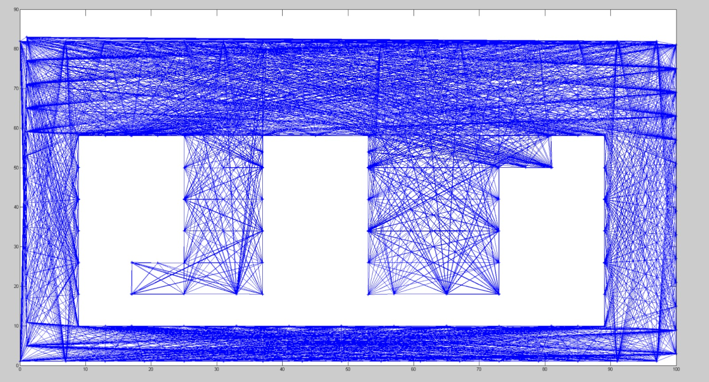
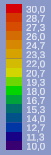
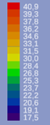

# Simulation

Durch die COVID-19 Pandemie konnte das entwickelte System nicht unter realen Bedingungen getestet werden, wie es zeitlich im Sommersemester 2020 geplant war. Aus diesem Grund wurde nach Abwägung mehrerer Möglichkeiten die Entscheidung getroffen eine Simulation zu entwickeln. Diese hat die Aufgabe die thermische Verhaltensweise eines Raumes, seiner enthaltenen Objekte (z.B. Heizung, Fenster) und der Benutzer, sowie die Bewegungsverhaltensweisen der Benutzer zu simulieren, um somit approximiert die potenzielle Leistungsfähigkeit des Systems zu evaluieren. Die Simulation konnte während des Projektzeitraumes nicht fertiggestellt werden.

Zur Visualisierung der Simulation wird die Spiele-Engine Unity verwendet. Diese kam auch parallel in der Veranstaltung „Mixed Reality“ von Prof. Dr.-Ing. Adler zum Einsatz, welcher gerne als Ansprechpartner für Probleme, die Unity betrafen, zur Verfügung stand.

## Thermische Simulation

Für die Simulierung der thermodynamischen Verhaltensweisen wird die Finite-Elemente-Methode, ein numerisches Verfahren zur Lösung von Differentialgleichungen, auf die thermodynamischen Gleichungen der Wärmeleitung angewendet. Hierbei wird der Raum in endlich kleine Bereiche („Finite-Elemente“) aufgeteilt und die Interaktionen zwischen den Elementen, wiederholt für ein diskretes Zeitintervall, berechnet. Die Größe der Bereiche und des Zeitintervalls hat großen Einfluss auf die Genauigkeit der Simulation.  

Die thermodynamischen Effekte der Wärmekonvektion und Wärmestrahlung wurden nicht implementiert, da beide Effekte eine höhere Komplexität aufweisen, für die keine Ressourcen im bereits ambitionierten Zeitplan bereitstanden. Insbesondere die realitätsnahe Simulation von Fluiden ist hochgradig nicht-trivial. Die Navier-Stokes-Gleichungen, welche ein mathematisches Modell der Strömung von linear-viskosen newtonschen Fluiden darstellen, sind bekanntermaßen hart zu lösen und sogar Teil der sieben Millenium-Probleme, auf die jeweils ein Preisgeld von einer Millionen US-Dollar ausgesetzt sind und von denen bisher nur eines gelöst ist (Stand 27.08.2020).  

Der Raum wird durch ein zweidimensionales Model approximiert. Dies verringert den Aufwand der Visualisierung und Simulation erheblich, da ein zweidimensionales Skalar-Feld, welches jedem Punkt im Raum eine Temperatur zuordnet, einfacher darzustellen ist und nur ein Bruchteil der physikalischen Interaktionen und des Speicherplatzes eines dreidimensionalen Skalar-Feldes benötigt.  

Jenes Model approximiert einen Raum als ein Rechteck, welches durch die Parameter Raumgröße, Raumposition und Wanddicke definiert ist. Weiterhin kann ein Raum mit thermischen Objekten9 interagieren. Thermische Objekte besitzen ebenfalls eine Größe und Position, sowie eine thermische Oberfläche, thermisches Material, Temperatur und einen Indikator, ob das thermische Objekt die Position zur Laufzeit verändern kann, welcher jedoch lediglich dem Zweck der Laufzeitoptimierung dient. Das thermische Objekt kann zur Laufzeit diese Eigenschaften im Gegensatz zum Raum ändern. Die initialen Parameter hierfür werden aus einer XML-Datei ausgelesen. 

Der Raum wird durch eine zuvor festgelegte Kantenlänge `x` in gleich große Quadrate, „Finite-Elemente“ unterteilt, wodurch jedes „Finite-Element“ vier Nachbar-„Finite-Elemente“ besitzt. 


Soll ein Frame von der Unity-Engine für die Visualisierung berechnet werden, wird festgestellt wie viel Zeit `𝛿t_LetzterFrame` seit der Berechnung des letzten Frames vergangen ist. Dabei wird `𝛿t_LetzterFrame` durch ein zuvor festgelegtes konstantes Zeitintervall `𝛿t` geteilt, um die Anzahl der Schleifendurchläufe zu berechnen. Dies entkoppelt den Wert `𝛿t` von `𝛿t_LetzterFrame`, welcher stark fluktuieren kann. Da nur eine diskrete Anzahl `n ∈ ℕ0` an Schleifendurchläufen durchgeführt werden können, wird die Anzahl der Schleifendurchläufe auf die nächstkleinere Ganzzahl abgerundet und die verbleibende Zeit auf `𝛿t_LetzterFrame`
des nächsten Frames addiert. 

Bei einem Schleifendurchlauf wird für jedes „Finite-Element“ der Wärmestrom `𝛿Q/𝛿t` berechnet. Dieser ergibt sich aus der Summe der partiellen Wärmeströme `𝛿Q_i/𝛿t`.

```𝛿Q/𝛿t = ∑ (𝛿Q_i/𝛿t)```
 

Die Simulation unterscheidet dabei zwischen partiellen Wärmeströmen zwischen zwei benachbarten „Finiten-Elementen“ und den partiellen Wärmeströmen zwischen „Finiten-Elementen“ und thermischen Objekten. Haben zwei benachbarte „Finite-Elemente“ das gleiche thermische Material wird der partielle Wärmestrom über die thermische Leitfähigkeit 𝜆 des thermischen Materials berechnet: 

```𝛿Q_i/𝛿t = A ∙ (𝜆 / l) ∙(T0 − Ti)```
 

Obwohl der Raum nur eine zweidimensionale Ausdehnung hat wurde hier angenommen, dass ein „Finites-Element“ die Höhe `h=x` hat und somit einen Würfel darstellt wodurch sich die Querschnittsfläche wie folgt berechnet: 

```A = x ∙ h = x²```
 

Die Distanz zwischen den Mittelpunkten zweier „Finiter-Elemente“ ist so groß wie die Kantenlänge eines „Finiten-Elements“ `l=x`, da die „Finiten-Elemente“ alle gleich großen Quadrate sind, welche schachbrettmusterartig angeordnet sind.      

```⇒ 𝛿Q_i/𝛿t = x²∙ (𝜆 / x) ∙ (T0 − Ti) = 𝜆 ∙ x ∙ (T0 − Ti)```
 

Haben zwei benachbarte „Finite-Elemente“ unterschiedliche thermische Materialien, wird der partielle Wärmestrom über den Wärmeübergangskoeffizient 𝛼 der beiden thermischen Materialien berechnet: 

```𝛿Q_i/𝛿t = A ∙ 𝛼 ∙ (T0 − Ti)=x2∙ 𝛼 ∙ (T0 − Ti)```
 

Bei der Berechnung des Wärmestroms zwischen einem thermischen-Objekt und den „Finite-Elementen“ wird zunächst berechnet, welche „Finite-Elemente“ ganz oder nur teilweise innerhalb der Fläche des thermischen Objekts liegen. Für thermische Objekte, die einen Indikator haben, dass diese ihre Position nicht ändern, wird jene Berechnung nur einmal ausgeführt. Der Anteil des „Finiten-Elementes“ an der thermischen Oberfläche des thermischen Objektes wird als Querschnittsflächeninhalt `A` für die Berechnung des partiellen Wärmestroms verwendet. Hierfür wird ebenfalls der Wärmeübergangskoeffizient zwischen den thermischen Materialien des „Finite-Elementes“ und dem thermischen-Objekt benutzt.  

Nachdem alle Wärmeströme berechnet wurden, wird berechnet, wie viel Wärme `𝛿Q` innerhalb des Zeitintervalls `𝛿t` übertragen wurde.  

```𝛿Q/𝛿t ⇒ 𝛿Q = (𝛿Q/𝛿t) ∙ 𝛿t```
 

Für „Finite-Elemente“ wird die Temperaturänderung über die spezifische Wärmekapazität des thermischen Materials berechnet. 

```𝛿Q = m ∙ c ∙ 𝛿T   ⇒   𝛿T = 𝛿Q / (m ∙ c)```
 

An thermisch -Objekte wird lediglich der Wert der übertragenen Wärme `𝛿Q` übergeben. Jedes thermische-Objekte implementiert das eigene thermische Verhalten basierend auf dem übergebenen Wert. Dieser Mechanismus macht sich das “Open-Closed-Prinzip" zu Nutze, da zukünftig neue thermische Objekte ausschließlich die Schnittstelle implementieren müssen.  

Weiterhin macht sich die thermische Simulation das “Dependency-Inversion-Prinzip" zu Nutze, da konkrete Implementierungen der abstrakten Schnittstellen und Parameter zur Laufzeit über "Dependency Injection“ an die Simulationslogik übergeben werden. Dies führt zu einer losen Kopplung zwischen der Simulationslogik und den Abhängigkeiten jener Logik. 

Vor Beginn der Simulation wird eine Raumtemperatur und eine Außentemperatur festgelegt. Die Außentemperatur kann während die Simulation ausgeführt wird verändert werden. Jedes “Finite-Element” des Innenraums und der Wand wird mit der Raumtemperatur um eine zufällige Abweichung um ±0,5°C initialisiert. Alle “Finiten-Elemente”, die nicht zum Innenbereich des Raumes oder der Wand gehören, haben dauerhaft die Außentemperatur, die selbst bei Wärmezufuhr nicht geändert wird, da der Wärmeaustausch eines Raumes mit der Umgebung nahezu immer einen vernachlässigbaren Effekt auf die durchschnittliche Umgebungstemperatur ausübt. 

## Externe Anbindung des Gebäudeautomatisierungsservers FHEM 

Da die Evaluation von FHEM das Hauptziel der Simulation darstellt, muss die Simulation mit FHEM interagieren können. Hierzu wurden im FHEM- Gebäudeautomatisierungsserver virtuelle Geräte angelegt, die für die FHEM-Logik die Rolle von realen Sensoren oder Aktuatoren einnehmen.  

In der Simulation findet man analog dazu externe Objekte18, die Schnittstellen für die Interaktion mit der Simulation bieten. Jedes externe Objekt hält dabei eine Referenz auf eine Serververbindung. Auch hier wurde das ”Open-Closed-Prinzip“ und ”Dependency-Inversion-Prinzip“ angewendet, da neue, externe Objekte durch die Implementierung der Schnittstellen einfach hinzugefügt werden können und durch „Dependency Injection“ eine lose-Kopplung zwischen den Objekten der Simulation und den externen Objekten entsteht, was insbesondere bei Tests hilfreich war, da die Simulation in der Anfangsphase nicht mit einer realen Verbindung zu FHEM getestet werden musste, sondern mit einem „Mockup“ der Serververbindungsschnittstelle ebenfalls funktionsfähig war.  

Die konkret verwendete Implementation der Serververbindungsschnittstelle interagiert über die FHEM-HTTP-API. Wird zum Beispiel ein Fenster in der Simulation geöffnet, dann stellt das konkrete, externe Fenster-Objekt einen entsprechenden HTTP-Post-Request, welcher den virtuellen FHEM-Fensterkontakt auf geöffnet setzt. 

Der Nachteil der HTTP-Anbindung ist, dass lesende Zugriffe, wie zum Beispiel beim Stundenplan, nur über Polling möglich sind. Um den Overhead zu limitieren, besitzt fast jedes externe Objekt einen lese-Cache, der in periodischen Zeitintervallen oder bei Schreibvorgängen invalidiert wird.  

## Benutzerverhalten 

Das Modell für das Verhalten der Benutzer basiert auf für die thermische Simulation relevanten, vereinfachten Erfahrungen der Teammitglieder.  

Benutzer können entweder die Rolle der Studierenden oder des Dozenten annehmen, jedoch kann sich jederzeit nur ein Dozent im Raum aufhalten.  

Findet gemäß den Informationen des Stundenplans keine Vorlesung statt, verlassen Benutzer den Raum. Diese Regel wird unter allen Umständen ausgeführt, während alle folgenden Regeln Einschränkungen unterliegen. 

In den Pausen setzt sich der Dozent auf seinen Stuhl, während einige der Studierenden sich frei durch den Raum bewegen. Ob ein Studierender auf seinem Platz sitzen bleibt oder aufsteht, um sich zu bewegen, wird über die Verwendung eines Pseudozufallszahlengenerators und einem vorab festgelegten Prozentsatz realisiert. 

In der Vorlesung setzen sich die Studierenden hin, während der Dozent sich zufällig durch den Raum bewegt. 

Ist in der Pause oder der Vorlesung einem Benutzer zu kalt oder zu warm geht dieser zum Tablet des Raumes und öffnet oder schließt gegebenenfalls Fenster beziehungsweise verstellt die Solltemperatur. 

Damit ein Benutzer nicht durch Objekte hindurch geht, wie zum Beispiel Tische, wurde ein Pathfinding-Algorithmus entwickelt. Aus den Parametern, die den Aufbau und den Inhalt eines Raumes beschreiben, wird ein Graph erstellt, der die Wege enthält, auf denen sich ein Benutzer bewegen kann, welcher beispielhaft für den Raum 9.428 mit MATLAB visualisiert wurde. 

    

Wird für den simulierten Benutzer die Entscheidung getroffen, dass dieser sich zu einem bestimmten Punkt im Raum bewegen soll, wird über den A*-Algorithmus der kürzeste Weg zu jenem Punkt berechnet. Dieser ist durchschnittlich schneller als der Dijkstra-Algorithmus, da der A*-Algorithmus durch die Verwendung einer Heuristik zu den informierten Suchen gehört. 

Um die Geschwindigkeit, mit der sich Personen durch den Raum bewegen, zu variieren, wird jeder Person bei der Initialisierung eine Pseudozufallszahl von 0 bis 1 (inklusive der Grenzwerte) zugewiesen. Bevor die Simulation gestartet wird und während die Simulation ausgeführt wird, kann die minimale und maximale Bewegungsgeschwindigkeit festgelegt werden.   Die Bewegungsgeschwindigkeit ergibt sich aus der bijektiven, linearen Abbildung des Zufallswertes auf das Intervall zwischen der minimalen und maximalen Bewegungsgeschwindigkeit (inklusive der Grenzwerte). 

Für das Temperaturempfinden eines Benutzers wird das gleiche Prinzip verwendet. Bei der Initialisierung einer Person wird eine Pseudozufallszahl zwischen 0 bis 1 (inklusive der Grenzwerte) für die minimale und maximale Wohlfühltemperatur zugewiesen, welche beide auf festgelegte Intervalle abgebildet werden, um die minimale und maximale Wohlfühltemperatur einer Person zu bestimmen. 

Durch diese Prozesse wird das Verhalten der Person stärker variiert, was der Realität näher ist. 

Im letzten Entwicklungsstand der Simulation konnte das Benutzerverhalten nicht vollständig realisiert werden. Der Programmcode für alle hier beschriebenen Funktionen wurde geschrieben, jedoch traten bei Tests Fehler auf, deren Ursache bislang ungeklärt sind. Beispielsweise melden einige Skripte wiederholt Null-Pointer-Exceptions beim Zugriff auf externe Abhängigkeiten. Jedoch sollten diese bei der Initialisierung über “Dependency-Injektion” zugewiesen worden sein, was in vergangen Versionen fehlerfrei funktioniert hat. Erschwerend kommt hinzu, dass diese und andere Fehler nur zufällig auftreten. Dies könnte ein Hinweis sein, dass eine “Raise-Condition” vorliegt, welche notorisch schwer durch konventionelles Debugging zu entdecken sind. 

## Visualisierung 

Zur Visualisierung der Lufttemperaturen wurden Quadrate angelegt, deren Größe angepasst werden kann. Um die Temperatur durch Farben darstellen zu können, wurden bestimmten Temperaturen bestimmte Farbwerte zugeordnet. Die Auswahl der Farben erfolgte dabei nach einer Abstimmung im Simulationsteam. 

Zur Interpolation einer Farbe werden die Grundfarben benötigt, welche von der Temperatur eingeschlossen wird. Des Weiteren wird die Differenz zwischen der Temperatur, welche den wärmeren Farbwert darstellt und der Temperatur des zu berechnenden Pixels benötigt. Mit Hilfe dieser 3 Parameter wird der Farbwert interpoliert. Diese Berechnung muss für den Rot-, Grün-, und Blauanteil der Farben durchgeführt werden. Dabei ist zu beachten, dass diese Berechnung nicht durchgeführt werden darf, wenn es sich bei dem zu berechnenden Pixel um den wärmsten handeln sollte, da sonst ein Fehler 19 entstehen würde. 

    
Abbildung 3: statische Skalierung
 
    
Abbildung 4: dynamische Skalierung


Dem Nutzer wurde außerdem die Möglichkeit gegeben, zwischen einer statischen und einer dynamischen Skalierung zu wählen. Die Unterschiede sind in den beiden obigen Abbildungen zu sehen. Die statische Skalierung ermöglicht dabei das Erkennen kleinerer Temperaturunterschiede, falls dies notwendig ist. Dafür muss lediglich die höchste und geringste Temperatur angegeben werden, die Zwischenwerte werden anschließend daraus errechnet. Sollte die statische Temperaturskalierung aktiviert sein, kann es passieren, dass es im Raum eine Temperatur gibt, welche kleiner ist als die kleinste eingestellte Temperatur in der Skalierung. In diesem Fall wird der kälteste Farbwert gewählt. 

Sowohl Wand- als auch Luft-Pixel müssen dabei im Stande sein, eine Temperatur zu speichern und diese wiedergeben zu können.  

Zur detailgetreueren Darstellung des Raumes sollten Raumelemente hinzugefügt werden, mit welchen ein simulierter Benutzer gegebenenfalls interagieren kann. Beispiele dafür wären Stühle, Türen, Fenster und Heizungen. 